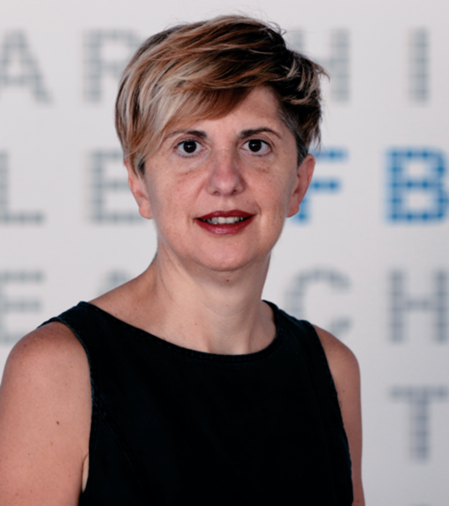

## Program

The program will be announced after the acceptance date

## Invited Speaker: Chiara Ghidini
{: style="float: left"}
She is a senior Research Scientist at Fondazione Bruno Kessler (FBK), Trento, Italy, where she heads the Process & Data Intelligence (PDI) research unit and is responsible of the scientific ordination of the new centre of digital Health & Well Being. Her scientific work in the areas of Semantic Web, Knowledge Engineering and Representation, Multi-Agent Systems and Process Mining is internationally well known and recognised, and she has made significant scientific contributions in the areas of: formal semantics for contextual reasoning and multi-context logics; formal frameworks for the specification of deliberative resource bounded agents; ontology mappings and integration; collaborative modeling platforms, business process modelling, and predictive business process monitoring. She has been involved in a number of international research projects, among which the FP7 Organic.Lingua and SO-PC-Pro European projects and the current network of Excellence Humane-AINet, as well as industrial projects in collaboration with companies in the Trentino area.

## List of accepted Papers

### Full Papers
- Guy Amit, Fabiana Fournier, Shlomit Gur and Lior Limonad: _Model-informed LIME Extension for Business Process Explainability_
- Björn Rafn Gunnarsson, Jochen De Weerdt and Seppe Vanden Broucke: _A framework for encoding the multi-location load state of a business process_
- Phuong Nguyen, Vatche Isahagian, Vinod Muthusamy and Aleksander Slominski: _Summarizing Process Traces for Analysis Tasks: An Intuitive and User-controlled Approach_
- Zihang Su, Artem Polyvyanyy, Nir Lipovetzky, Sebastian Sardina and Nick van Beest Janus: _A Simulator for Continuous Goal Recognition over Changing Environments_
- Sergey Zeltyn, Segev Shlomov, Avi Yaeli and Alon Oved: _Prescriptive Process Monitoring in Intelligent Process Automation with Chatbot Orchestration_
- Tobias Zimpel, Andrea Wild, Hansjörg Schrade and Stefan Kirn: _Association Rule Mining to Study Process-Related Cause-Effect-Relationships in Pig Farming_

### Extended Abstract

- Giuseppe De Giacomo, Marco Favorito, Francesco Leotta, Massimo Mecella and Luciana Silo: _Modeling resilient cyber-physical processes and their composition from digital twins via Markov Decision Processes_
- Bettina Fazzinga, Sergio Flesca, Filippo Furfaro and Luigi Pontieri: _Explainable Interpretation of Low-Level Process Traces via Abstract Argumentation_
- Paolo Felli, Marco Montali and Sarah Winkler: _Reasoning and Verification with Data Petri Nets_
- Chiara Di Francescomarino, Ivan Donadello, Chiara Ghidini, Fabrizio Maria Maggi and Williams Rizzi: _Making sense of temporal data: the DECLARE encoding_
- Praveen Venkateswaran, Vinod Muthusamy, Yara Rizk and Vatche Isahagian: _Towards Continual Learning in Interactive Digital Assistants for Process Automation_
- Marco Roveri, Claudio Di Ciccio, Chiara Di Francescomarino and Chiara Ghidini: _Computing unsatisfiable cores for LTLf specifications_
- Simone Agostinelli and Andrea Marrella: Intelligent Robotic Process Automation: _Generating Executable RPA Scripts from Unsegmented UI Logs_
- Antonio Ielo, Francesco Ricca and Luigi Pontieri: _Declarative Mining of Business Processes via ASP_
- Diego Calvanese, Giuseppe De Giacomo, Marco Montali and Fabio Patrizi: _Verification of Generic, Relational Transition Systems_
- Peter Fettke and Alexander Rombach: _Towards Integrated AI Planning and BPM_

